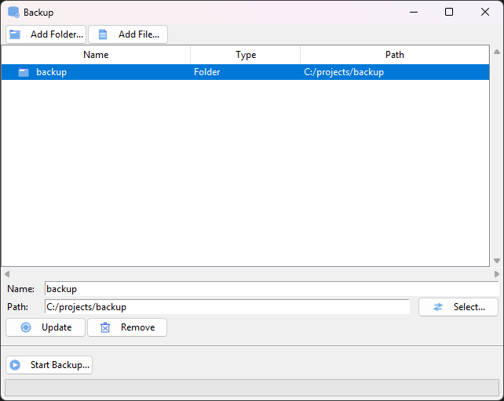

# Backup



## Build and Run

Create and enter Python virtual environment.

```bash
python3 -m venv venv
. venv/bin/activate
```

Install depenencies.

```bash
pip3 install -r requirements.txt
``` 

Run the application.

```bash
./backup.py
```

## Install Development Dependencies

```bash
pip3 install -r dev_requirements.txt
```
